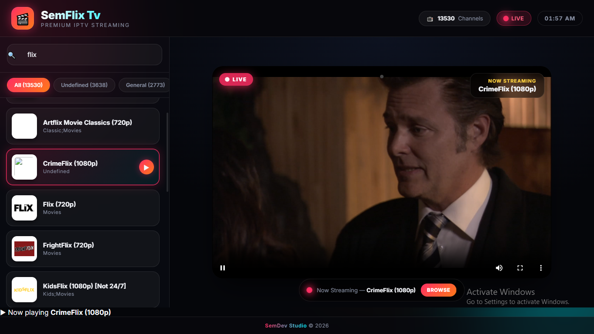

<div align="center">

# 🎬 SemFlix

### Watch Movies & Videos Online for Free

<p>
  <a href="https://semflix.netlify.app">
    
  </a>
  
  
  
</p>

**SemFlix** is a modern movie streaming web application where users can watch free movies and videos online with a clean, fast, and responsive interface.

### 🌐 Live Website
## https://semflix.netlify.app

</div>

---

## ✨ Features

- 🎥 Watch free movies and videos
- ⚡ Fast and responsive UI
- 📱 Mobile-friendly design
- 🔍 Easy movie browsing
- ❤️ Clean and modern interface
- 🌙 Beautiful user experience
- 🚀 Lightweight and fast loading

---

## 📸 Preview

> Add screenshots here

| Home | Movies |
|------|---------|
|  |  |

---

## 🚀 Getting Started

Clone the repository:

```bash
git clone https://github.com/yourusername/semflix.git
```

Go into the project folder:

```bash
cd semflix
```

Install dependencies:

```bash
npm install
```

Start the development server:

```bash
npm run dev
```

---

## 🛠️ Built With

- HTML5
- CSS3
- JavaScript
- React
- Vite
- Netlify

---

## 📂 Project Structure

```
semflix/
│
├── public/
├── src/
│   ├── components/
│   ├── pages/
│   ├── assets/
│   └── styles/
│
├── package.json
├── vite.config.js
└── README.md
```

---

## 🌍 Live Demo

Visit the website:

### 👉 https://semflix.netlify.app

---

## 🤝 Contributing

Contributions are welcome!

1. Fork the repository
2. Create your feature branch

```bash
git checkout -b feature/NewFeature
```

3. Commit your changes

```bash
git commit -m "Add amazing feature"
```

4. Push to your branch

```bash
git push origin feature/NewFeature
```

5. Open a Pull Request

---

## ⭐ Support

If you like this project, please consider giving it a **⭐ Star** on GitHub.

---

## 📄 License

This project is licensed under the **MIT License**.

---

<div align="center">

### 🎬 SemFlix

**Watch • Stream • Enjoy**

Made with ❤️ by SemDev Studio

</div>
