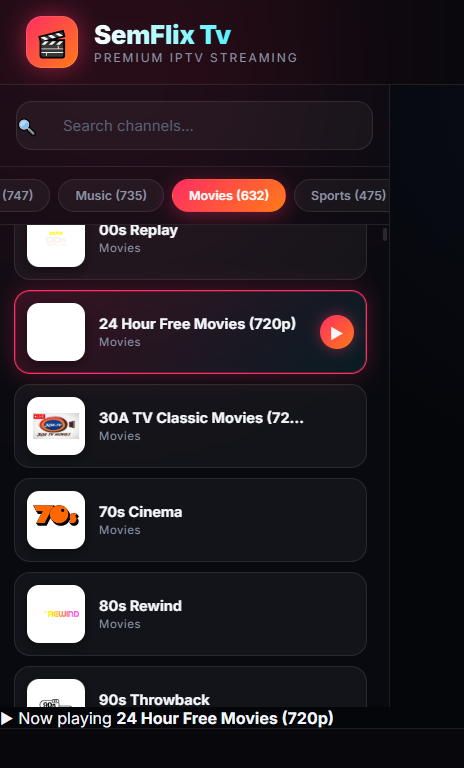

<div align="center">

# 🎬 SemFlix Movies - Free Premium IPTV Channels

### Watch Movies & Videos Online for Free

<p>
  <a href="https://semflix.netlify.app">
    
  </a>
  
  
  
</p>

**SemFlix** is a modern, responsive movie streaming platform designed to provide a smooth and enjoyable entertainment experience across desktop and mobile devices. Built with performance and simplicity in mind, SemFlix offers an intuitive interface that makes it easy for users to browse, discover, and watch video content with minimal loading times and a clean, visually appealing design.

The application focuses on delivering a seamless user experience through a well-organized layout, responsive navigation, and optimized performance. Whether users are exploring trending titles, searching for specific content, or watching their favorite videos, SemFlix aims to provide a fast, reliable, and engaging platform.

Developed using modern web technologies, SemFlix emphasizes scalability, maintainability, and accessibility. Its responsive design ensures a consistent experience across different screen sizes, while its lightweight architecture helps pages load quickly and efficiently.

As the project continues to evolve, additional features, interface improvements, and enhanced functionality will be introduced to create an even richer streaming experience. SemFlix is built with the goal of combining modern design principles with reliable performance to deliver a high-quality web application for media discovery and video streaming.

### 🌐 Live Website
## https://semflix.netlify.app

</div>

---

## ✨ Features

- 🎥 Watch free movies and Live videos
- ⚡ Fast and responsive UI
- 📱 Mobile-friendly design
- 🔍 Easy movie browsing
- ❤️ Clean and modern interface
- 🌙 Beautiful user experience
- 🚀 Lightweight and fast loading

---

## 📸 Preview

> SemFlix Screenshots

| Home | Channels |
|------|---------|
|  |  |

---

## 🚀 Getting Started

Clone the repository:

```bash
git clone https://github.com/danielsem65/semflix.git
```

Go into the project folder:

```bash
cd semflix
```

Install dependencies:

```bash
npm install
```

Start the development server:

```bash
npm run dev
```

---

## 🛠️ Built With

- HTML5
- CSS3
- JavaScript
- React
- Netlify

---

## 📂 Project Structure

```
semflix/
│
├── public/
├── src/
│   ├── components/
│   ├── pages/
│   ├── assets/
│   └── styles/
│
├── package.json
├── semflix.config.js
└── README.md
```

---

## 🌍 Live Channels

Visit the website:

### 👉 https://semflix.netlify.app

---

## 🤝 Contributing

Contributions are welcome!

1. Fork the repository
2. Create your feature branch

```bash
git checkout -b feature/NewFeature
```

3. Commit your changes

```bash
git commit -m "Add amazing feature"
```

4. Push to your branch

```bash
git push origin feature/NewFeature
```

5. Open a Pull Request

---

## ⭐ Support

If you like this project, please consider giving it a **⭐ Star** on GitHub.

---

## 📄 License

This project is licensed under the **MIT License**.

---

<div align="center">

### 🎬 SemFlix Movies

**Watch • Stream • Enjoy**

Made with ❤️ by SemDev Studio

</div>
